# Spyglass User Guide

Spyglass helps users **manage public and private contacts discreetly and efficiently**. Instead of worrying about prying eyes or managing separate files for sensitive information, you can **view public contacts at a glance while keeping private data hidden behind a secure password lock**.

Spyglass is optimized for a **keyboard-centric workflow**. By pairing a high-speed Command Line Interface (CLI) with a clean Graphical User Interface (GUI), it eliminates the friction of traditional mouse-driven menus, catering for users who value speed in high-stakes situations.

<page-nav-print />

--------------------------------------------------------------------------------------------------------------------

## About This Guide

This guide is designed for **individuals who require a secure and discreet way to manage contacts without drawing attention from others** in their household. It provides a step-by-step walkthrough for **setting up the application, managing your privacy settings, and using the command-based interface** to keep your data private.

Whether you are a tech-savvy user or have never used a command terminal before, this guide will help you navigate Spyglass with confidence.

### Conventions Used

Before you begin, please take a moment to understand the command format used throughout this guide:

* **Words in `UPPER_CASE`** are parameters to be supplied by you.
  * *Example:* In `add -n NAME`, `NAME` is a parameter which can be used as `add -n John Doe`.
* **Items in square brackets `[]`** are optional.
  * *Example:* `-n NAME [-t TAG]` can be used as `-n John Doe -t friend` or just `-n John Doe`.
* **Items with `…` after them** can be used multiple times, including zero times.
  * *Example:* `[-t TAG]…` can be used as ` ` (0 times), `-t friend`, `-t friend -t family` etc.
* **Parameters can be in any order.**
  * *Example:* If the command specifies `-n NAME -p PHONE`, then `-p PHONE -n NAME` is also acceptable.
* **Extraneous parameters** for commands that do not take parameters (such as `list`, `exit` and `clear`) will be ignored.

---

## Getting Started

Follow these steps to set up Spyglass on your computer.

### 1. Install Java 17 or above
Check if you already have Java installed:

* **Windows:** Press `Win + R`, type `cmd`, press `Enter`. Then type `java -version`.
* **Mac:** Press `Cmd + Space`, type `terminal`, press `Enter`. Then type `java -version`.
* **Linux:** Open Terminal, then type `java -version`.

If you see “java version 17” or higher, skip to step 2.

**If you need to install Java:**
* **Windows:** Download the Windows x64 Installer from the [Oracle website](https://www.oracle.com/java/technologies/downloads/).
* **Mac:** Follow the precise JDK installation guide [here](https://se-education.org/guides/tutorials/javaInstallationMac.html).
* **Linux:** Use your package manager (e.g., `sudo apt install openjdk-17-jdk`).

### 2. Download Spyglass
Get the latest `.jar` file from our [Releases page](https://github.com/AY2526S2-CS2103T-T15-2/tp/releases).

### 3. Set up your Spyglass folder
Copy the `.jar` file into a folder of your choice (e.g., `Documents/Spyglass`). This will be your **home folder** where your data will be stored.

### 4. Run the application
* **Windows:** Navigate to your Spyglass folder in File Explorer.
  * Right-click in the folder and select **“Open Terminal here”** or **“Open PowerShell window here”**.
  * Type `java -jar Spyglass.jar` and press `Enter`.
* **Mac:** Press `Cmd + Space`, type `terminal`, and press `Enter`.
  * Type `cd ` followed by a space, then drag your Spyglass folder into the window and press `Enter`.
  * Type `java -jar Spyglass.jar` and press `Enter`.
* **Linux:** Open Terminal and navigate to your folder (e.g., `cd ~/Downloads`).
  * Type `java -jar Spyglass.jar` and press `Enter`.

### 5. Secure your data
On your first launch, you will be **prompted to set a password**. This password will be **used to access your sensitive contacts**.

For the examples in the rest of this guide, we will assume you have set your password as `myPassword123`.

<box type="info" seamless>
Your password cannot be empty, contain spaces or non-standard symbols (emojis, foreign language characters).

</box>

<box type="warning" seamless>

**Caution:**
Password entry is currently visible while typing (not masked). Perform password setup only in a trusted environment where your screen and keyboard input cannot be observed.

</box>

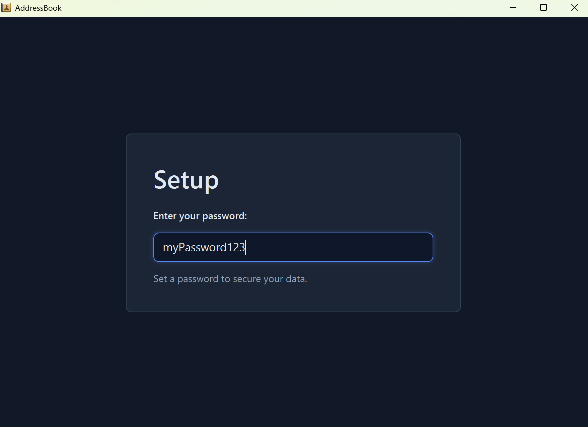

### 6. Try a few example commands

Upon launching the application, you should see an interface similar to the one below, pre-populated with some **sample data**.

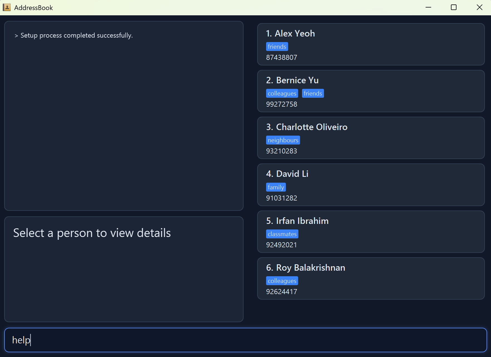

Type these commands into the **command box located at the bottom** of the interface and press **Enter**:

* `help` — Opens the command manual.
* `list` — Lists all contacts currently visible.
* `add -n John Doe -p 98765432 -e johnd@example.com -a John Street` — Adds a new contact.
* `unlock PASSWORD` — Switches to **Unlocked Mode** to see hidden contacts.
* `exit` — Securely closes the application.

Refer to the [Features](#features) section below for details on every available command.

--------------------------------------------------------------------------------------------------------------------

## User Interface Overview

This is the main interface of SpyGlass. It consists of:

* **Contact List** — Displays all contacts in your current view.
* **Contact Details** — Displays contact information in full detail (with email, address etc.) of the currently selected contact.
* **Command Box** — This is where you enter commands to interact with SpyGlass. Type your command here and press **Enter** to execute it.
* **Result History** - Displays the list of feedback messages of the commands you entered in the command box.

<box type="tip" seamless>

**Tip — Keyboard Navigation:**

* Use <kbd>Up</kbd> and <kbd>Down</kbd> in the Command Box to cycle through your past commands in the current mode, so you can quickly reuse and modify them.
* Use <kbd>Tab</kbd> and <kbd>Shift</kbd>+<kbd>Tab</kbd> to cycle through the displayed contact list. The selected contact will be highlighted and its full details will appear in the Contact Details panel.

</box>

--------------------------------------------------------------------------------------------------------------------

## App Modes: Locked and Unlocked

SpyGlass operates in two distinct modes to ensure your sensitive data remains protected:

* **Locked Mode**: Displays only **Public** contacts. In this mode, the application window title is **AddressBook** to mask its true identity and provide plausible deniability.
* **Unlocked Mode**: Displays the **full contact list**, including **both Public and Sensitive** entries. The application window title changes to **SpyGlass** to indicate elevated access.

### Switching Between Modes

* **To Unlock**: Use the [unlock](#unlocking-the-app-unlock) command followed by your password to reveal your hidden contacts.
* **To Lock**: Use the [lock](#locking-the-app-lock) command to immediately hide sensitive contacts and return the application to its public state.

When you launch the app, it starts in **Locked mode** by default. While Unlocked mode provides a unified view of all your data, switching back to Locked mode ensures that only non-sensitive information is visible to onlookers.

--------------------------------------------------------------------------------------------------------------------

## Features

<box type="info" seamless>

**Note**: If you are using a PDF version of this document, be careful when copying and pasting commands that span multiple lines as space characters surrounding line-breaks may be omitted when copied over to the application.
</box>

### Command Summary

| Action | Format & Examples | Mode Availability |
|--------|-------------------|-------------------|
| **Add** | `add -n NAME -p PHONE -e EMAIL -a ADDRESS [-t TAG]…​`   e.g., `add -n James Ho -p 22224444 -e jamesho@example.com -a 123, Clementi Rd` | Any |
| **Clear** | `clear` | Any |
| **Delete** | `delete INDEX`   e.g., `delete 3` | Any |
| **Edit** | `edit INDEX [-n NAME] [-p PHONE] [-e EMAIL] [-a ADDRESS] [-t TAG]…​`   e.g., `edit 2 -n James Lee` | Any |
| **Find** | `find KEYWORD [MORE_KEYWORDS]`   e.g., `find James Jake` | Any |
| **Help** | `help [COMMAND]`   e.g., `help add` | Any |
| **List** | `list` | Any |
| **View** | `view INDEX`   e.g., `view 1` | Any |
| **Unlock** | `unlock PASSWORD`   e.g., `unlock myPassword123` | **Locked Only** |
| **Lock** | `lock` | **Unlocked Only** |
| **Setup** | `setup` | **Unlocked Only** |
| **Toggle** | `toggle INDEX`   e.g., `toggle 1` | **Unlocked Only** |

### Unrestricted Commands

<box type="info" icon=":fa-solid-user-secret:" seamless>

Unrestricted commands are the basic commands of Spyglass that are available in both **Locked** and **Unlocked** modes.

</box>

#### Viewing help : `help`

Shows a **concise command manual** in the command history panel. If `COMMAND` is provided, SpyGlass shows help for that specific command. Otherwise, it shows the **general help overview of the commands available in the current app mode**.

Format: `help [COMMAND]`

<box type="info" seamless>

**Note:** In **Locked mode**, `help lock`, `help unlock`, `help setup`, and `help toggle` return `No command 'COMMAND'` as their manuals are hidden in that mode.

</box>

**Examples**
* `help`
* `help add`
* `help edit`

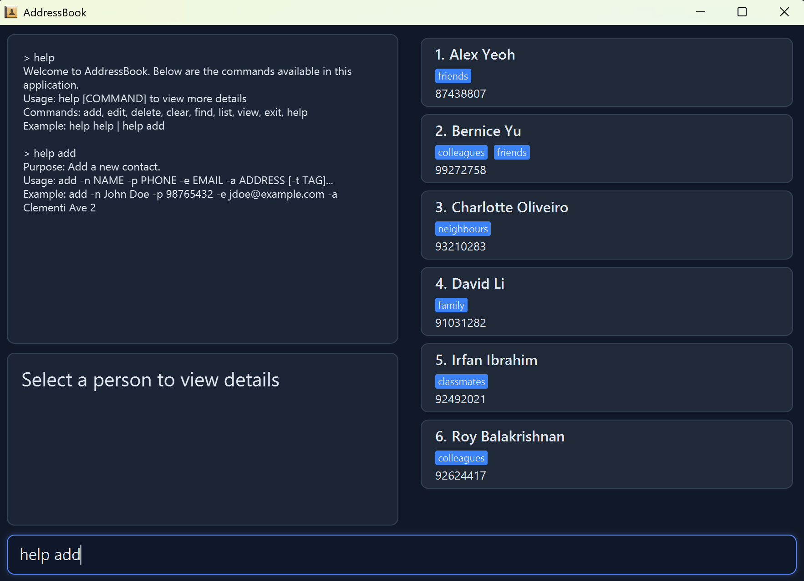

#### Adding a person: **`add`**

Adds a person to the address book.

**Format:** `add -n NAME -p PHONE_NUMBER -e EMAIL -a ADDRESS [-t TAG]…​`

<box type="tip" seamless>

**Tip:** A person can have any number of tags (including 0)
</box>

* After a successful add, SpyGlass **highlights** the newly added contact.
* **Mode-specific status:** 
  * Contacts added in **Unlocked mode** are set to **`Sensitive`** by default.
  * Contacts added in **Locked mode** are set to **`Public`** by default.
  * To change a contact's status after adding, refer to the [toggle](#toggling-a-contact-status-toggle) command.
* If the new contact duplicates an existing contact, SpyGlass **rejects** the command in **Unlocked Mode**. In **Locked mode**, if the duplicate is an existing `Sensitive` contact, SpyGlass **overrides** that sensitive contact instead.

**Parameters**

`add` parameters follow the constraints below:

| Parameter | Prefix | Required | Constraints | Parameter Example |
| --- | --- | --- | --- | --- |
| Name | `-n` | Yes | Must be non-empty after trimming. Only alphanumeric characters and spaces. No punctuation such as `'`, `-`, `_`, `.`. | `-n Alice Tan` |
| Phone | `-p` | Yes | Must be non-empty after trimming. Digits only, minimum 3 digits. | `-p 98765432` |
| Email | `-e` | Yes | Must be non-empty after trimming. Must follow `local-part@domain`. Local-part allows alphanumeric plus `+ _ . -`, but cannot start/end with special characters or have consecutive special characters. Domain labels must start/end with alphanumeric and may contain internal `-`. Final label must be at least 2 characters. | `-e alice_tan+work@example-domain.com` |
| Address | `-a` | Yes | Must be non-empty after trimming. Any characters are allowed, including `-` and punctuation. | `-a Blk 123, #05-67` |
| Tag | `-t` | No | If provided, each tag must be alphanumeric only (no spaces or punctuation). Multiple `-t` prefixes are allowed. | `-t friend -t coworker` |

<box type="info" seamless>

Prefix parsing behavior with `-` prefixes (`-n`, `-p`, `-e`, `-a`, `-t`):
* Any substring like ` -n`, ` -p`, ` -e`, ` -a`, or ` -t` inside a value is treated as a **new prefix**, not plain text.
* This means values containing words that start with one of these patterns (after a space) may be split unexpectedly.
* Example: `-a Block -n 12` is parsed as address `Block` and then a new name prefix `-n`.

Special-character input tips:
* For names, replace punctuation with spaces: `O'Neil` -> `O Neil`, `Anne-Marie` -> `Anne Marie`.
* For tags, remove symbols and separators: `high-priority` -> `highpriority`, `team_a` -> `teama`.
* For values that must contain a hyphenated token beginning with a reserved prefix (e.g. `-n...`), rephrase to avoid starting that token with `-n`, `-p`, `-e`, `-a`, or `-t` after a space.

</box>

**Examples:**
* `add -n John Doe -p 98765432 -e johnd@example.com -a John street, block 123, #01-01`
* `add -n Betsy Crowe -t friend -e betsycrowe@example.com -a Newgate Prison -p 1234567 -t criminal`

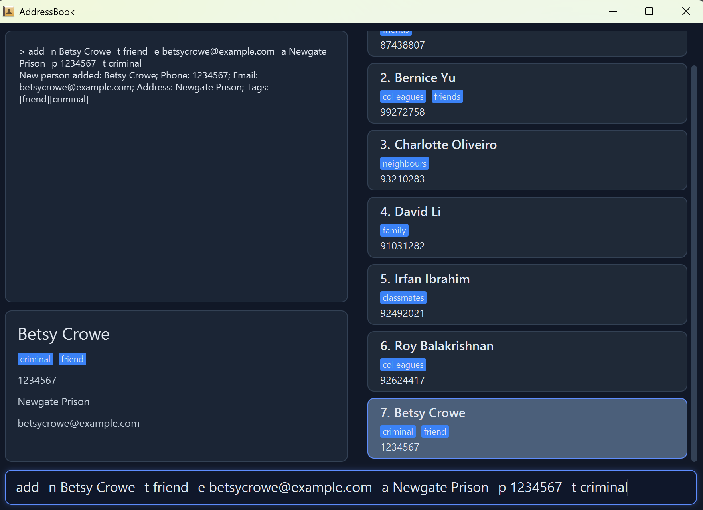

#### Listing all persons: **`list`**

Shows a list of all persons in the address book.

**Format:** `list`

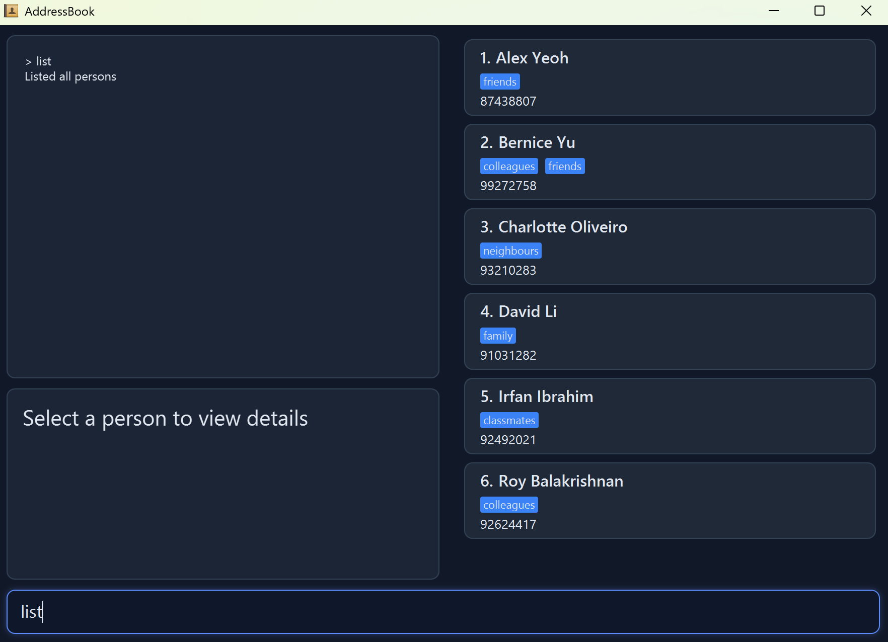

#### Editing a person: **`edit`**

Edits an existing person in the address book.

**Format:** `edit INDEX [-n NAME] [-p PHONE] [-e EMAIL] [-a ADDRESS] [-t TAG]…​`

<box type="tip" seamless>

**Tip:** Edited values use the same constraints and `-` prefix parsing behavior as `add`.
If a value includes special characters that are rejected, normalize it first (for example, `O'Neil` -> `O Neil`).

</box>

* Edits the person at the specified `INDEX`. The index refers to the index number shown in the displayed person list. The index **must be a positive integer** 1, 2, 3, …​
* **At least one** of the optional fields must be provided.
* Existing values will be **updated** to the input values.
* When editing tags, the existing tags of the person will be **removed** (i.e., adding of tags is not cumulative).
* You can **remove all** the person’s tags by typing `-t ` without specifying any tags after it.
* After a successful edit, Spyglass keeps the edited contact **highlighted**.
* If the edited contact would duplicate an existing contact, Spyglass **rejects** the command in **Unlocked mode**. In **Locked mode**, if the duplicate is an existing `Sensitive` contact, Spyglass **overrides** that hidden contact instead. Otherwise, the command is **rejected**.

<box type="info" seamless>

**Note:** All edited fields must conform to the specific requirements and constraints (such as character limits and patterns) specified in the [**`add`**](#adding-a-person-add) command.
</box>

**Examples:**
* `edit 1 -p 91234567 -e johndoe@example.com` Edits the phone number and email address of the 1st person to be `91234567` and `johndoe@example.com` respectively.
* `edit 2 -n Betsy Crower -t ` Edits the name of the 2nd person to be `Betsy Crower` and clears all existing tags.

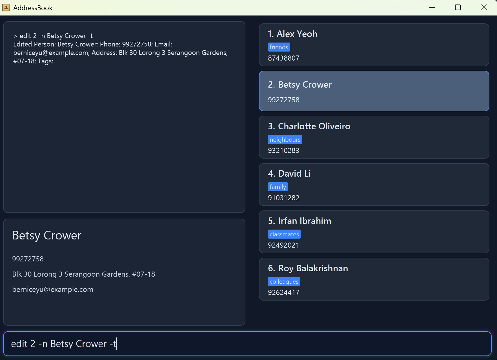

#### Locating persons by name: **`find`**

Finds persons whose names contain any of the given keywords.

**Format:** `find KEYWORD [MORE_KEYWORDS]`

* The search is **case-insensitive**. e.g., `hans` will match `Hans`
* The **order of the keywords does not matter**. e.g., `Hans Bo` will match `Bo Hans`
* **Only the name** is searched.
* **Only full words** will be matched. e.g., `Han` will not match `Hans`
* Persons matching **at least one** keyword will be returned (i.e., `OR` search). e.g., `Hans Bo` will return `Hans Gruber`, `Bo Yang`

**Examples:**
* `find John` returns `john` and `John Doe`
* `find alex david` returns `Alex Yeoh`, `David Li` 
  
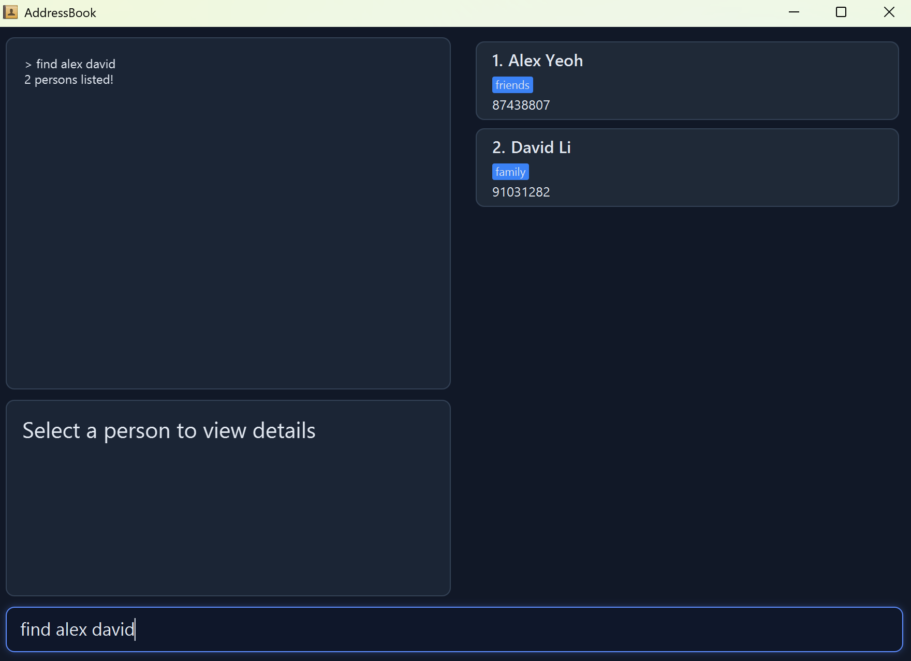

#### Viewing a contact: **`view`**

Displays detailed information for a specific contact by selecting them using their index number.

<box type="tip" seamless>

**Tip:** If you prefer not to type the `view` command, you can use <kbd>`Tab`</kbd> or <kbd>`Shift + Tab`</kbd> to cycle through and highlight contacts in the list.
</box>

**Format:** `view INDEX`

* Views the person identified by the index number shown in the displayed person list.
* The index **must be a positive integer** 1, 2, 3, …​
* The contact details will be displayed in the **Details Panel** for full viewing.

<box type="info" seamless>

**Note**: Viewing a contact in **Unlocked mode** will also reveal its status details (**Public** or **Sensitive**) within the Details Panel.

</box>

**Examples:**
* `view 1` displays the details of the 1st contact in the currently displayed list.
* `find John` followed by `view 1` displays the details of the 1st person in the search results.

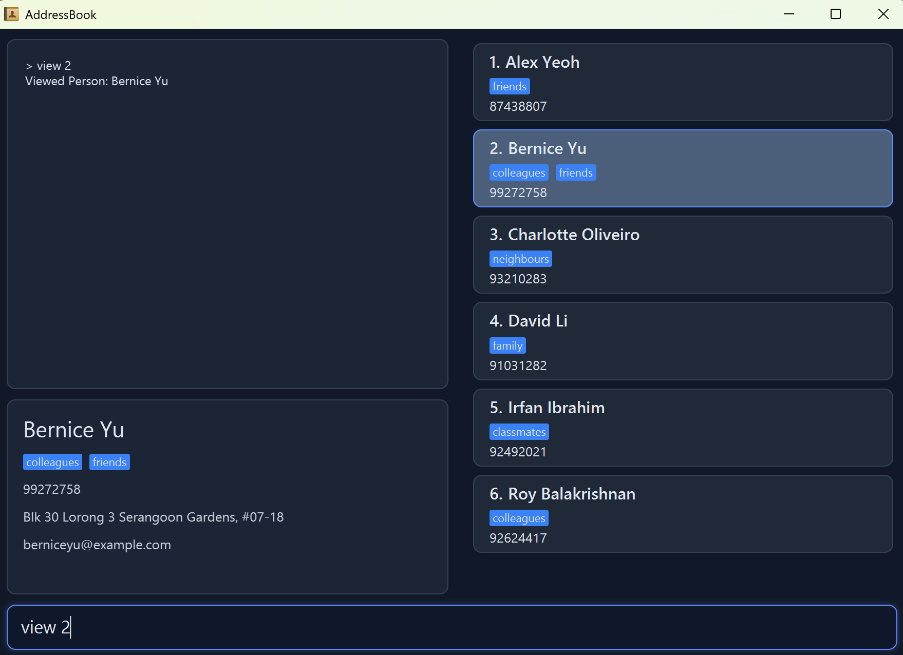

#### Deleting a person: **`delete`**

Deletes the specified person from the address book.

**Format:** `delete INDEX`

* Deletes the person at the specified `INDEX`.
* The index refers to the index number shown in the displayed person list.
* The index **must be a positive integer** 1, 2, 3, …​

**Examples:**
* `list` followed by `delete 2` deletes the 2nd person in the address book.
* `find Betsy` followed by `delete 1` deletes the 1st person in the results of the `find` command.

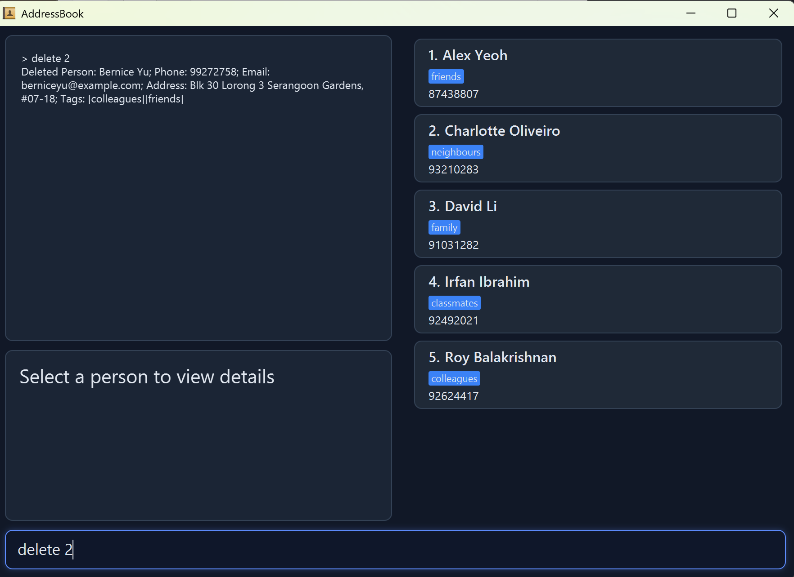

#### Clearing all entries: **`clear`**

Clears all entries from the address book.

**Format:** `clear`

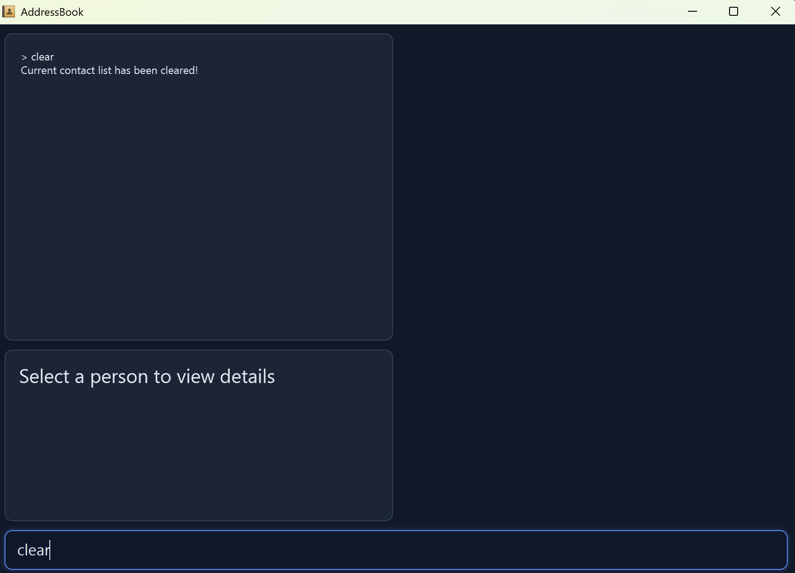

<box type="warning" seamless>

**Caution:** This command will **clear all contacts** currently accessible in your view.
* In **Locked mode**, this clears all **public contacts**.
* In **Unlocked mode**, this clears **everything** (both public and sensitive entries).

Use this command **cautiously** and only as a **last resort**, as this action is irreversible.
</box>

#### Exiting the program: **`exit`**

Exits the program.

**Format:** `exit`

### Restricted Commands

<box type="info" icon=":fa-solid-user-secret:" seamless>

Restricted commands are **mode-dependent**, whose availability changes based on whether Spyglass is in **Locked** or **Unlocked** mode. With the exception of `unlock` (which is only available in Locked mode), all other restricted commands are accessible **only in Unlocked mode**.

When the app is in **Locked mode**, entering a restricted command incorrectly will result in an **`Unknown command.` message**.
</box>

#### Locking the app: **`lock`**

Switches the application to **Locked mode**, hiding all sensitive entries and displaying only the public contact list.

**Format:** `lock`

* Once locked, the application window title changes to **AddressBook** to mask the app's true identity.

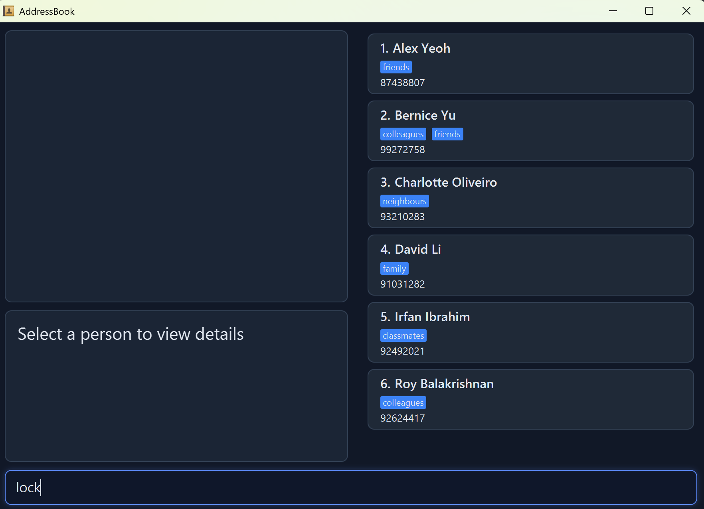

#### Unlocking the app: **`unlock`**

Switches the application to **Unlocked mode** by verifying your password. This reveals your hidden sensitive contacts alongside your existing public contacts.

**Format:** `unlock PASSWORD`

* You **must** provide the correct password that was configured during the setup process.
* The password is **case-sensitive** (e.g., `MyPassword123` is different from `mypassword123`).
* If the password is **incorrect**, the app remains in Locked mode and sensitive contacts stay hidden.

**Examples:**
* `unlock myPassword123` : Unlocks the app and reveals the full contact list.

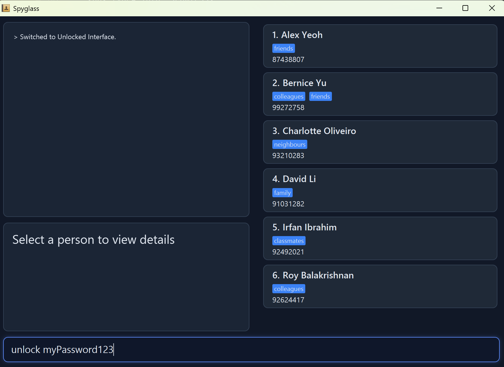

#### Reconfiguring password: **`setup`**

Brings you to the initial configuration page to update your password.

**Format:** `setup`

* Using this command allows you to **change the password** used to reveal your sensitive contacts.

<box type="info" seamless>

**Note**: The password is **only updated once the setup process is fully completed**, which can be seen in the result history with `> Setup process completed successfully`.
</box>

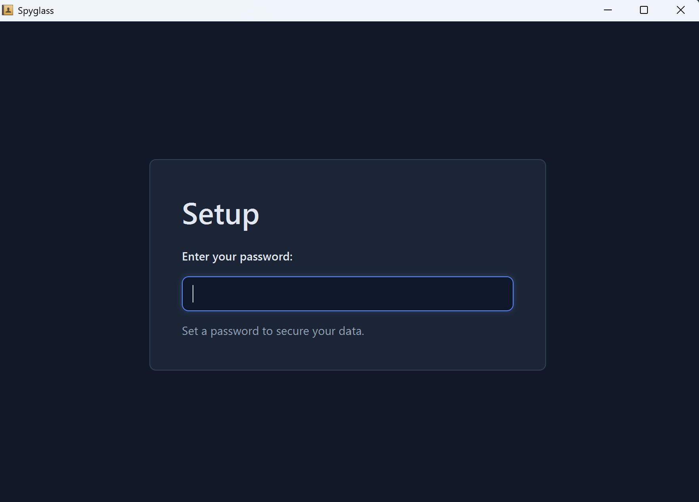

* To check whether the password has been successfully updated, check the result history for the message `> Setup process completed successfully`.

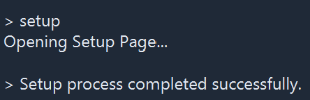

#### Toggling a contact status: **`toggle`**

Toggles the specified contact between **`Public`** and **`Sensitive`** status.

**Format:** `toggle INDEX`

* Toggles the contact at the specified **`INDEX`**.
* The index refers to the index number shown in the displayed person list.
* The index **must be a positive integer** `1, 2, 3, ...`
* **Status Flip Logic:**
  * If the contact is currently **`Public`**, it will be changed to **`Sensitive`**.
  * If the contact is currently **`Sensitive`**, it will be changed to **`Public`**.
* **Immediate Effect:** 
  * A contact toggled to **`Sensitive`** will **disappear** from the list when the app is in **Locked Mode**.
  * A contact toggled to **`Public`** will **remain visible** in both modes.
* After a successful toggle, SpyGlass refreshes the displayed list and keeps the toggled contact **highlighted** so the updated status is reflected in the current view.

**Examples:**
* `toggle 1` : Toggles the 1st contact's status. If they were **Public**, they are now **Sensitive** (and vice versa).

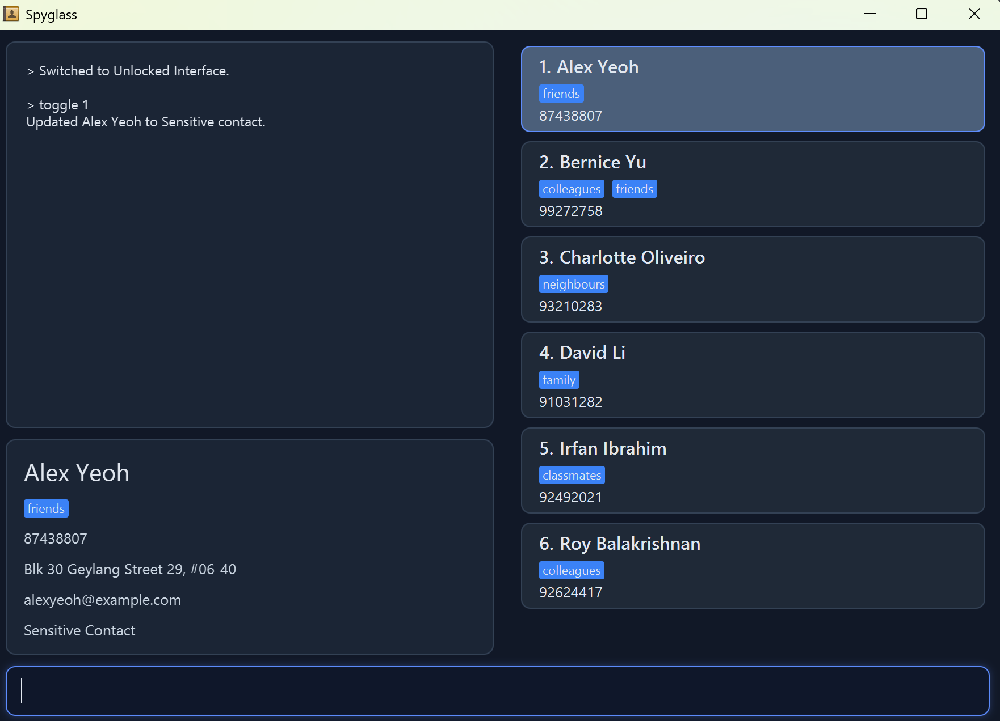

### Saving the data

Spyglass data are saved in the hard disk **automatically** after any command that changes the data. There is **no need** to save manually.

### Editing the data file

Spyglass data for unlocked and locked modes are saved automatically as a JSON file **`[JAR file location]/data/addressbook.json`**. Advanced users are welcome to update data directly by editing that data file.

The file stores the **contact data at the top**, followed by your **password**.

<box type="warning" seamless>

**Caution:**
* The password is stored in plaintext in the local data file (no file encryption).
* This project assumes the app is used in a secure environment (for example, a personal device that is already protected by OS/login controls). Therefore, data-file encryption is intentionally not used

</box>

<box type="warning" seamless>

**Caution:**
* If the password field is **missing, empty**, or contains **spaces or invalid characters** (e.g., emojis or foreign characters), the app will prompt you to set a password again upon the next launch.
* If manual edits to the data file make its **format invalid**, SpyGlass will **discard all data** and start with an empty file at the next run.
</box>

As certain edits can cause SpyGlass to behave in unexpected ways, it is **highly recommended to take a backup** of the file before editing it. We suggest editing the data file **only if you are confident** that you can update it correctly according to the specified format.

---

## FAQ

**Q**: How do I transfer my data to another Computer? 
**A**: Install the app in the other computer and overwrite the empty data file it creates with the file that contains the data of your previous Spyglass home folder.

---

## Known issues

1. **When using multiple screens**, if you move the application to a secondary screen, and later switch to using only the primary screen, the GUI will open off-screen. The remedy is to delete the **`preferences.json`** file created by the application before running the application again.

---

## Glossary

### Interface and Command Syntax
* **Command**: A specific textual directive provided by the user to trigger a particular action.
* **Parser**: The internal component that analyzes user input by decomposing it into identifiable segments, such as prefixes and parameters, for the application to process.
* **Prefix**: A unique identifier or character string used within a command to specify the category of data being entered.
* **Parameter**: The specific information or data value that follows a prefix, representing the actual content to be handled.
* **CLI (Command Line Interface)**: A text-based interface where users interact with Spyglass by typing specific commands on a keyboard.
* **GUI (Graphical User Interface)**: The visual component of the application that displays contact lists and command results, allowing users to see information processed via the CLI.

### Application States
* **Locked Mode**: The default, public state of the application. It functions as a standard, mundane address book to provide plausible deniability and hide the existence of any sensitive data from onlookers.
  * *Visual Identifier:* The window title displays as **"AddressBook"** to blend in with standard utility software.
* **Unlocked Mode**: The secure state of the application, revealed only after entering a hidden password. This mode allows the user to view, add and manage sensitive contacts that are otherwise hidden.
  * *Visual Identifier:* The window title displays as **"Spyglass"** to confirm the user has access to private data.

### Contact and Command Types
* **Sensitive Contact**: A contact entry that is **only visible and accessible** while the application is in Unlocked Mode.
* **Public Contact**: A contact entry that remains **visible in both** Locked and Unlocked modes.
* **Restricted Command**: A command that is **only operational** in a specific mode.
* **Unrestricted Command**: A command that **functions consistently** across both Locked and Unlocked modes.
* **Highlighted Contact**: The specific contact entry currently selected from the list, whose full details are displayed in the UI component located at the bottom left of the interface.

### Technical Environment
* **Mainstream OS**: Windows, Linux, Unix, macOS.
* **JAR**: A Java Archive file format used to distribute the Spyglass application and its required libraries as a single, portable executable file.
* **JSON (JavaScript Object Notation)**: A lightweight, human-readable data format used by Spyglass to store contact information, password and application settings in local storage.
