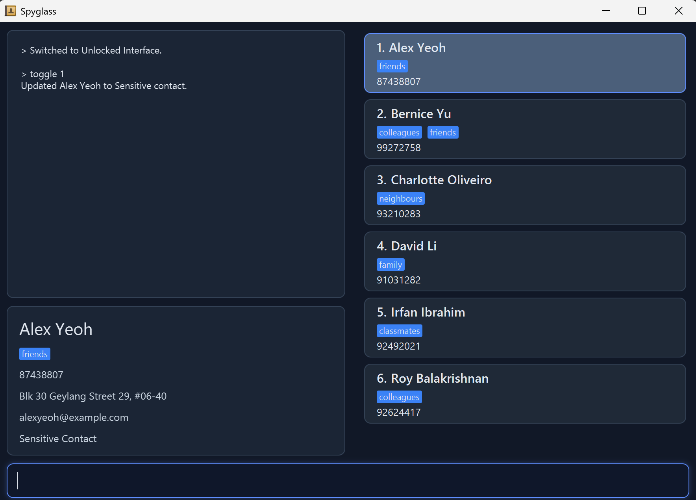
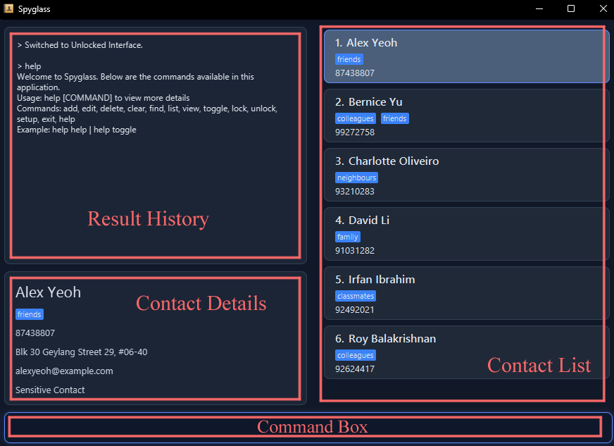

# SpyGlass User Guide

SpyGlass is a desktop app for managing public and secret contacts, optimised for typing commands while still having a visual display. If you can type fast, SpyGlass handles tasks faster than standard applications.

<!-- * Table of Contents -->
<page-nav-print />

--------------------------------------------------------------------------------------------------------------------

## Quick start

1. Ensure you have **Java 17** or above installed in your computer.
    * **Mac users:** Ensure you have the precise JDK version prescribed [here](https://se-education.org/guides/tutorials/javaInstallationMac.html).

2. Download the latest `.jar` file from [here](https://github.com/AY2526S2-CS2103T-T15-2/tp/releases).

3. Copy the file to the folder you want to use as the *home folder* for SpyGlass.

4. Open a command terminal, `cd` into the folder where you put the jar file, and use the `java -jar SpyGlass.jar` command to run the application.

5. On your first launch, you will be prompted to secure your data. Enter a password to initialise SpyGlass. Note that your password cannot be empty or contain spaces.
   

6. After setting your password, a GUI similar to the image below should appear. Note how the app contains some sample data to help you get started.
   

7. **Execute Commands:**
  Type your command in the command box and press **Enter** to execute it. For example, typing `help` prints the command manual in the command history panel.

   **Try these example commands:**

    * `list` : Lists all contacts in the current mode.
    * `add -n John Doe -p 98765432 -e johnd@example.com -a John street, block 123, #01-01` : Adds a contact named `John Doe`.
    * `delete 3` : Deletes the 3rd contact shown in the current list.
    * `unlock PASSWORD` : Unlocks the app to access secured contacts.
    * `lock` : Locks the app to display only a limited set of public contacts.
    * `exit` : Exits the app.

8. Refer to the [Features](#features) section below for details on every available command.

--------------------------------------------------------------------------------------------------------------------

## User Interface Overview

This is the main interface of SpyGlass. It consists of:

* **Contact List** — Displays all contacts in your current view. In Locked mode, you see your public contacts only; in Unlocked mode, you see both public and sensitive contacts.
* **Contact Details** — Displays contact information in full detail (with email, address etc.) of the currently selected contact.
* **Command Box** — This is where you enter commands to interact with SpyGlass. Type your command here and press **Enter** to execute it.
* **Result History** - Displays the list of feedback messages of the commands you entered in the command box.

<box type="tip" seamless>

**Tip — Command Box History:** You can use up and down arrow keys to cycle through your past commands in the current mode to quickly access and modify past commands.

</box>

--------------------------------------------------------------------------------------------------------------------

## Features

<box type="info" seamless>

**Notes about the command format:** 

* Words in `UPPER_CASE` are the parameters to be supplied by the user. 
  e.g. in `add -n NAME`, `NAME` is a parameter which can be used as `add -n John Doe`.

* Items in square brackets are optional. 
  e.g `-n NAME [-t TAG]` can be used as `-n John Doe -t friend` or as `-n John Doe`.

* Items with `…`​ after them can be used multiple times including zero times. 
  e.g. `[-t TAG]…​` can be used as ` ` (i.e. 0 times), `-t friend`, `-t friend -t family` etc.

* Parameters can be in any order. 
  e.g. if the command specifies `-n NAME -p PHONE_NUMBER`, `-p PHONE_NUMBER -n NAME` is also acceptable.

* Extraneous parameters for commands that do not take in parameters (such as `list`, `exit` and `clear`) will be ignored. 
  e.g. if the command specifies `list 123`, it will be interpreted as `list`.

* If you are using a PDF version of this document, be careful when copying and pasting commands that span multiple lines as space characters surrounding line-breaks may be omitted when copied over to the application.
</box>

### App Modes: Locked and Unlocked

SpyGlass has two distinct modes:

* **Locked Mode**: Displays a public set of contacts. In this mode, the application window displays the name **AddressBook** to mask its true identity as SpyGlass.
* **Unlocked Mode**: A private view that displays a hidden set of contacts. Access this mode by entering your password.

Each mode maintains its own separate list of persons. Contacts added in Locked mode will only appear in Locked mode, and contacts added in Unlocked mode will only appear in Unlocked mode.

When you first launch the app, it starts in **Locked mode**. After password setup, use the `unlock` command with your password to switch to Unlocked mode.

### Command History Display

The Command Display panel keeps a history of past command results.

### Unrestricted Commands

<box type="info" icon=":fa-solid-user-secret:" seamless>

Unrestricted commands are the basic functions of SpyGlass that are available in both Locked and Unlocked modes.

</box>

#### Viewing help : `help`

Shows a concise command manual in the command history panel.

Format: `help [COMMAND]`

Examples:
* `help`
* `help add`
* `help toggle`

#### Adding a person: `add`

Adds a person to the address book.

Format: `add -n NAME -p PHONE_NUMBER -e EMAIL -a ADDRESS [-t TAG]…​`

<box type="tip" seamless>

**Tip:** A person can have any number of tags (including 0)
</box>

Examples:
* `add -n John Doe -p 98765432 -e johnd@example.com -a John street, block 123, #01-01`
* `add -n Betsy Crowe -t friend -e betsycrowe@example.com -a Newgate Prison -p 1234567 -t criminal`

#### Listing all persons : `list`

Shows a list of all persons in the address book.

Format: `list`

#### Editing a person : `edit`

Edits an existing person in the address book.

Format: `edit INDEX [-n NAME] [-p PHONE] [-e EMAIL] [-a ADDRESS] [-t TAG]…​`

* Edits the person at the specified `INDEX`. The index refers to the index number shown in the displayed person list. The index **must be a positive integer** 1, 2, 3, …​
* At least one of the optional fields must be provided.
* Existing values will be updated to the input values.
* When editing tags, the existing tags of the person will be removed i.e adding of tags is not cumulative.
* You can remove all the person’s tags by typing `-t ` without
    specifying any tags after it.

Examples:
*  `edit 1 -p 91234567 -e johndoe@example.com` Edits the phone number and email address of the 1st person to be `91234567` and `johndoe@example.com` respectively.
*  `edit 2 -n Betsy Crower -t ` Edits the name of the 2nd person to be `Betsy Crower` and clears all existing tags.

#### Locating persons by name: `find`

Finds persons whose names contain any of the given keywords.

Format: `find KEYWORD [MORE_KEYWORDS]`

* The search is case-insensitive. e.g `hans` will match `Hans`
* The order of the keywords does not matter. e.g. `Hans Bo` will match `Bo Hans`
* Only the name is searched.
* Only full words will be matched e.g. `Han` will not match `Hans`
* Persons matching at least one keyword will be returned (i.e. `OR` search).
  e.g. `Hans Bo` will return `Hans Gruber`, `Bo Yang`

Examples:
* `find John` returns `john` and `John Doe`
* `find alex david` returns `Alex Yeoh`, `David Li` 
  

#### Deleting a person : `delete`

Deletes the specified person from the address book.

Format: `delete INDEX`

* Deletes the person at the specified `INDEX`.
* The index refers to the index number shown in the displayed person list.
* The index **must be a positive integer** 1, 2, 3, …​

Examples:
* `list` followed by `delete 2` deletes the 2nd person in the address book.
* `find Betsy` followed by `delete 1` deletes the 1st person in the results of the `find` command.

#### Clearing all entries : `clear`

Clears all entries from the address book.

Format: `clear`

#### Exiting the program : `exit`

Exits the program.

Format: `exit`

### Restricted Commands

<box type="info" icon=":fa-solid-user-secret:" seamless>

Restricted commands are mode-dependent, whose availability changes based on whether SpyGlass is in Locked or Unlocked mode.

**Note:** When the app is in **Locked mode**, entering a restricted command incorrectly will result in an `Unknown command` message. This is intentional to mask the app's capabilities from unauthorized users.
</box>

#### Locking the app : `lock`

Locks the app and switches to Locked mode, displaying only the contacts in the Locked mode list.

Format: `lock`

Example:
* `lock` : Locks the app and displays the limited contact list.

#### Unlocking the app : `unlock`

Unlocks the app and switches to Unlocked mode by verifying your password. This command displays the list of contacts in the Unlocked mode list.

Format: `unlock PASSWORD`

* You must provide the correct password that was set during the initial setup.
* If the password is incorrect, the app will remain locked.

Examples:
* `unlock mySecurePassword123` : Unlocks the app with the provided password.

#### Toggling a contact status : `toggle`

Toggles the specified contact between `Public` and `Sensitive`.

Format: `toggle INDEX`

* Toggles the contact at the specified `INDEX`.
* The index refers to the index number shown in the displayed person list.
* The index **must be a positive integer** `1, 2, 3, ...`
* This command is only available in **Unlocked Mode**.
* A contact toggled to `Sensitive` will no longer appear in Locked Mode.
* A contact toggled to `Public` will appear in Locked Mode.

Examples:
* `toggle 1` : Toggles the 1st contact's status.

### Saving the data

SpyGlass data are saved in the hard disk automatically after any command that changes the data. There is no need to save manually.

### Editing the data file

SpyGlass data for unlocked and locked modes are saved automatically as a JSON file `[JAR file location]/data/addressbook.json`. Advanced users are welcome to update data directly by editing that data file.

The file stores the contact data at the top, followed by your password.

<box type="warning" seamless>

**Caution:**
If the password field is missing, empty or contains spaces, the app will prompt you to set a password again when you next open it.
If your changes to the data file makes its format invalid, SpyGlass will discard all data and start with an empty data file at the next run.  Hence, it is recommended to take a backup of the file before editing it. 
Furthermore, certain edits can cause the SpyGlass to behave in unexpected ways (e.g., if a value entered is outside the acceptable range). Therefore, edit the data file only if you are confident that you can update it correctly.
</box>

--------------------------------------------------------------------------------------------------------------------

## FAQ

**Q**: How do I transfer my data to another Computer? 
**A**: Install the app in the other computer and overwrite the empty data file it creates with the file that contains the data of your previous SpyGlass home folder.

--------------------------------------------------------------------------------------------------------------------

## Known issues

1. **When using multiple screens**, if you move the application to a secondary screen, and later switch to using only the primary screen, the GUI will open off-screen. The remedy is to delete the `preferences.json` file created by the application before running the application again.

--------------------------------------------------------------------------------------------------------------------

## Command summary

Action     | Format, Examples
-----------|----------------------------------------------------------------------------------------------------------------------------------------------------------------------
**Add**    | `add -n NAME -p PHONE_NUMBER -e EMAIL -a ADDRESS [-t TAG]…​`   e.g., `add -n James Ho -p 22224444 -e jamesho@example.com -a 123, Clementi Rd, 1234665 -t friend -t colleague`
**Clear**  | `clear`
**Delete** | `delete INDEX`  e.g., `delete 3`
**Edit**   | `edit INDEX [-n NAME] [-p PHONE_NUMBER] [-e EMAIL] [-a ADDRESS] [-t TAG]…​`  e.g.,`edit 2 -n James Lee -e jameslee@example.com`
**Find**   | `find KEYWORD [MORE_KEYWORDS]`  e.g., `find James Jake`
**List**   | `list`
**Lock**   | `lock`
**Toggle** | `toggle INDEX`  e.g., `toggle 1`
**Unlock** | `unlock PASSWORD`  e.g., `unlock mySecurePassword123`
**Help**   | `help [COMMAND]`  e.g., `help add`

## Availability Table for Restricted Commands

| Command | Available In |
|---------|--------------|
| `unlock` | Locked Mode |
| `lock`   | Unlocked Mode |
| `toggle` | Unlocked Mode |
